# ☁️ Cloud & DevOps Notes — AI Resume Screener Project Workflow

> These notes follow the **actual workflow** of building and deploying the **AI-Powered Resume Screener**, explaining every Cloud & DevOps concept exactly where it is used in the project.

---

## 🔷 Project Overview

**AI Resume Screener** is a full-stack ML-powered system that screens, scores, and improves resumes using NLP and the Gemini AI API.

```mermaid
graph LR
    A[Resume Datasets] --> B[ML / NLP Models]
    B --> C[Flask Backend]
    C --> D[React + HTML Frontend]
    D --> E[Docker Containers]
    E --> F[CI/CD Pipeline]
    F --> G[Cloud Deployment]
    G --> H[Monitoring & Security]

    style A fill:#f9d0c4,stroke:#333,stroke-width:2px
    style B fill:#f4b6c2,stroke:#333,stroke-width:2px
    style C fill:#92a8d1,stroke:#333,stroke-width:2px
    style D fill:#80ced6,stroke:#333,stroke-width:2px
    style E fill:#618685,color:#fff,stroke:#333,stroke-width:2px
    style F fill:#b5e7a0,stroke:#333,stroke-width:2px
    style G fill:#d5e1df,stroke:#333,stroke-width:2px
    style H fill:#e3eaa7,stroke:#333,stroke-width:2px
```

### Technology Stack Table

| Layer | Technology | What it does |
| :--- | :--- | :--- |
| **Data** | `UpdatedResumeDataSet.csv` (~3MB) | Real labeled resume dataset for ATS scoring |
| **ML / AI** | scikit-learn, Gemini API (`google-generativeai`) | Classifies roles, scores ATS, generates career advice |
| **Backend** | Python, Flask, Flask-SQLAlchemy, Gunicorn | REST API serving predictions, auth, and resume analysis |
| **Frontend** | React 19, Vite, HTML/CSS (Tailwind) | Recruiter / candidate UI for upload and review |
| **Database** | MySQL (production), SQLite (local dev) | Stores users, resumes, OTPs |
| **Containers** | Docker, Docker Compose | Packages everything into portable containers |
| **CI/CD** | GitHub Actions | Automates testing, building, and deploying |
| **Cloud IaC** | Terraform, AWS EC2 | Provisions server with one command |
| **Monitoring** | Prometheus, Grafana | Tracks ATS scoring latency, errors, system health |

---

## 🔷 Step 1 — Writing the Code & Version Control (Git)
*(Syllabus: Unit I — Basics of Git, Lifecycle, Commands, Remote Repositories)*

Before anything else, we need a place to track our code. This is where **Git** comes in.

### What is Git?
Git is a **distributed version control system** — it tracks every change to every file, lets multiple developers collaborate, and allows you to roll back to any previous state.

### Git Lifecycle in Our Project

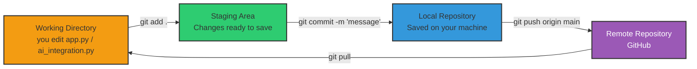

### Commands We Used

```bash
# 1. Initialize the repository
git init

# 2. Stage all project files
git add .

# 3. Commit with a descriptive message
git commit -m "feat: add Gemini AI integration for ATS scoring and career advice"

# 4. Connect to GitHub remote
git remote add origin https://github.com/USERNAME/Resume_Screener.git

# 5. Push to main branch
git push -u origin main

# 6. Create a development branch for testing new features
git checkout -b dev

# 7. After testing, merge back to main
git checkout main
git merge dev

# 8. View history
git log --oneline -10
```

### `.gitignore` — What NOT to Track

We created a `.gitignore` to exclude sensitive and generated files:

```
.venv/                  # Virtual environment (reinstalled via pip install)
__pycache__/            # Python bytecode cache
*.pyc, *.pyo, *.pyd     # Compiled Python files
.idea/                  # IDE config (PyCharm)
backend/.env            # Secret keys (Gemini API, SMTP, DB credentials)
*.log                   # Server log files
backend/*.db            # Local SQLite database (regenerated)
backend/server_*.log    # Runtime error logs
```

> **Why?** These files are either regeneratable, contain secrets, are environment-specific, or too large. Git should only track source code.

---

## 🔷 Step 2 — The Application: Backend (Flask API)
*(Syllabus: Unit I — DevOps Market Trends, Delivery Pipelines)*

### What We Built

A full-stack application with three main layers:

| Layer | Code Files | Role |
| :--- | :--- | :--- |
| **AI Models** | `model1.py`, `model2.py`, `model3.py`, `model4.py` | NLP pipeline, resume parsing, category classification |
| **Gemini Integration** | `ai_integration.py` | ATS feedback, career strategy, enhanced text, PDF/DOCX export |
| **Flask API Server** | `app.py` | REST API endpoints, session auth, file serving |
| **Database Layer** | `database.py` | SQLAlchemy models for User, Resume, OTP |

### API Endpoints Map

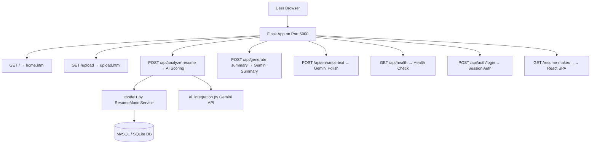

| Method | Endpoint | What It Does |
| :--- | :--- | :--- |
| `GET` | `/` | Home page — landing page |
| `POST` | `/api/analyze-resume` | Upload PDF/DOCX resume → ATS score + suggestions |
| `POST` | `/api/generate-summary` | Generates AI professional summary |
| `POST` | `/api/enhance-text` | Polishes resume bullet points via Gemini |
| `GET` | `/api/health` | DB + SMTP status check |
| `POST` | `/api/auth/register` | Register new user + OTP email |
| `POST` | `/api/auth/login` | Authenticate user + create session |
| `GET` | `/resume-maker/<path>` | Serves React SPA (Vite build) |
| `GET` | `/metrics` | Prometheus metrics endpoint |

### How `/api/analyze-resume` Works

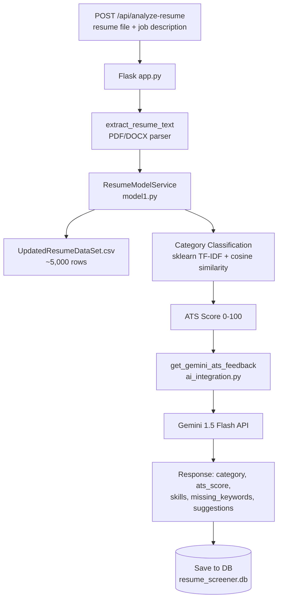

### Starting the Backend

```bash
cd backend
# Development mode
python app.py

# Production mode with Gunicorn
gunicorn app:app --workers 4 --bind 0.0.0.0:5000
```

---

## 🔷 Step 3 — The Frontend (React + HTML/CSS)
*(Syllabus: Unit I — DevOps Engineer Skills)*

The project has **two frontend layers**:

1. **HTML/CSS Frontend** (`forntend/html/`) — Traditional templates (home, upload, login, result)
2. **React SPA** (`client/`) — Resume Builder with React 19, Vite, Tailwind, Framer Motion

### Starting the React Frontend

```bash
# Install dependencies
cd client
npm install

# Development server
npm run dev
# UI available at: http://localhost:5173

# Production build
npm run build
# Output: client/dist/ (served by Flask at /resume-maker/...)
```

---

## 🔷 Step 4 — Containerization with Docker
*(Syllabus: Unit II — Containerization, Docker Architecture, Lifecycle, Docker Images)*

Our app requires Python 3.x, Flask, scikit-learn, PyPDF2, pdfplumber, python-docx, Node.js 20+, and Vite builds. Docker solves the *"it works on my machine"* problem.

### Virtualization vs Containerization

| Feature | Virtual Machine | Docker Container |
| :--- | :--- | :--- |
| **Size** | GBs — includes full guest OS | MBs — shares host OS kernel |
| **Startup time** | Minutes | Seconds |
| **Isolation** | Full (separate kernel) | Process-level (shared kernel) |
| **Performance** | Overhead from Hypervisor | Near-native performance |
| **Use case** | Running different OS types | Packaging apps for deployment |

### Docker Architecture in Our Project

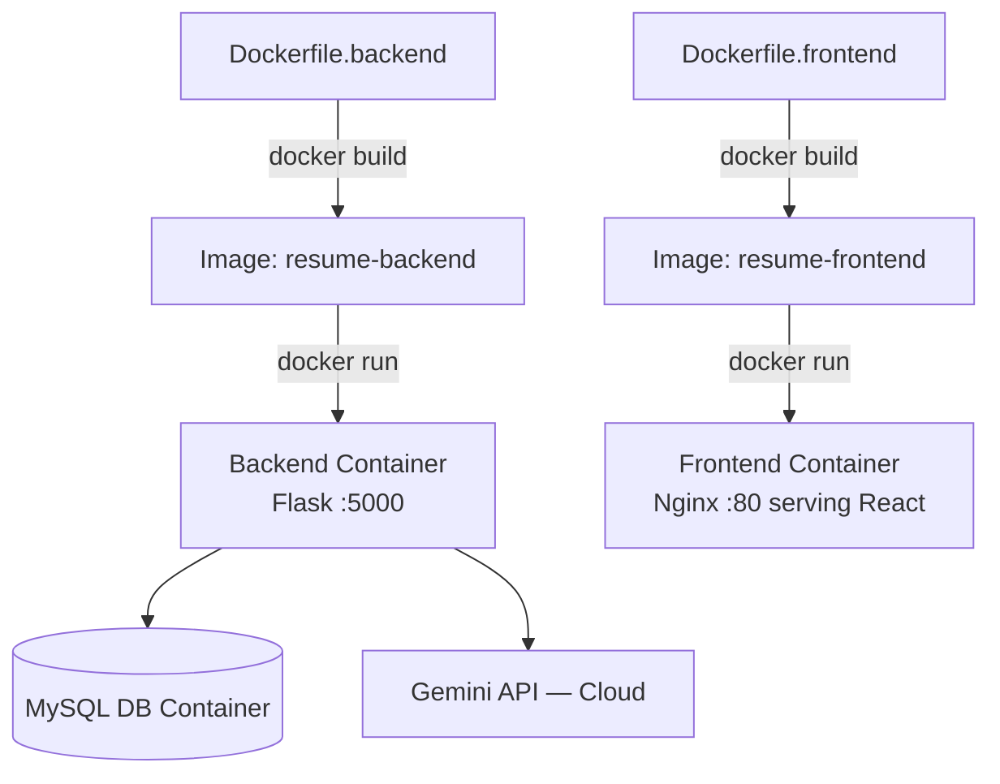

### Docker Lifecycle

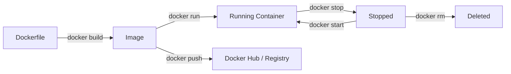

| Component | What it is |
| :--- | :--- |
| **Dockerfile** | Recipe / blueprint for building an image |
| **Image** | Read-only template built from Dockerfile |
| **Container** | Running instance of an image |
| **Registry** | Storage for images (Docker Hub, AWS ECR) |

### Our Backend Dockerfile (Multi-Stage Build)

```dockerfile
# docker/Dockerfile.backend

# ---- Stage 1: Builder (large — has all build tools) ----
FROM python:3.11-slim AS builder
WORKDIR /app

# Copy and install Python dependencies
COPY backend/requirements.txt .
RUN pip install --no-cache-dir -r requirements.txt

# Copy application source code
COPY backend/ ./backend/

# ---- Stage 2: Production (small — only runtime needed) ----
FROM python:3.11-slim
WORKDIR /app

# Copy installed packages and app from builder
COPY --from=builder /app .
COPY --from=builder /usr/local/lib/python3.11/site-packages \
     /usr/local/lib/python3.11/site-packages

# Expose API port
EXPOSE 5000

# Start with Gunicorn (production WSGI server)
CMD ["gunicorn", "backend.app:app", "--workers", "4", \
     "--bind", "0.0.0.0:5000", "--timeout", "120"]
```

> **Why multi-stage?** Stage 1 installs compilers and dev tools. Stage 2 copies only the essential runtime — making the final image **much smaller** and more secure.

### Our Frontend Dockerfile

```dockerfile
# docker/Dockerfile.frontend

# Stage 1: Build React production bundle
FROM node:20-alpine AS builder
WORKDIR /app
COPY client/package*.json ./
RUN npm ci
COPY client/ .
RUN npm run build

# Stage 2: Serve with Nginx (tiny production image)
FROM nginx:alpine
COPY docker/nginx.conf /etc/nginx/conf.d/default.conf
COPY --from=builder /app/dist /usr/share/nginx/html
EXPOSE 80
```

### Docker Commands We Use

```bash
# Build images
docker build -f docker/Dockerfile.backend -t resume-backend .
docker build -f docker/Dockerfile.frontend -t resume-frontend .

# Run containers
docker run -d -p 5000:5000 --name backend \
  -e GEMINI_API_KEY=your_key \
  -e SMTP_SERVER=smtp.gmail.com \
  resume-backend

docker run -d -p 3000:80 --name frontend resume-frontend

# View running containers
docker ps

# View container logs
docker logs backend
docker logs -f frontend          # -f = follow (live)

# Stop and remove
docker stop backend frontend
docker rm backend frontend

# Push to Docker Hub
docker tag resume-backend myuser/resume-backend:latest
docker push myuser/resume-backend:latest

# Run command inside a container
docker exec -it backend bash
```

---

## 🔷 Step 5 — Orchestrating with Docker Compose
*(Syllabus: Unit II — Cloud Infrastructure Services, Containerization)*

We have 4 services that need to run together:
1. **Backend** (Flask + Gunicorn)
2. **Frontend** (React via Nginx)
3. **Prometheus** (metrics collection)
4. **Grafana** (dashboards)

`docker-compose up -d` starts all of them with **ONE command**.

### `docker-compose.yml` — Full Stack Definition

```yaml
version: '3.8'

services:
  # --- Service 1: Flask Backend ---
  backend:
    build:
      context: .
      dockerfile: docker/Dockerfile.backend
    ports:
      - "5000:5000"               # host:container
    environment:
      - GEMINI_API_KEY=${GEMINI_API_KEY}
      - SMTP_SERVER=${SMTP_SERVER}
      - SMTP_USER=${SMTP_USER}
      - SMTP_PASS=${SMTP_PASS}
      - MYSQL_PUBLIC_URL=${MYSQL_PUBLIC_URL}
      - SECRET_KEY=${SECRET_KEY}
    volumes:
      - ./backend/downloads:/app/backend/downloads
    restart: unless-stopped
    networks:
      - resume-network

  # --- Service 2: React Frontend (served by Nginx) ---
  frontend:
    build:
      context: .
      dockerfile: docker/Dockerfile.frontend
    ports:
      - "3000:80"
    depends_on:
      - backend             # start backend first
    restart: unless-stopped
    networks:
      - resume-network

  # --- Service 3: Prometheus (Metrics Collection) ---
  prometheus:
    image: prom/prometheus:latest
    ports:
      - "9090:9090"
    volumes:
      - ./monitoring/prometheus.yml:/etc/prometheus/prometheus.yml
    networks:
      - resume-network

  # --- Service 4: Grafana (Dashboards) ---
  grafana:
    image: grafana/grafana:latest
    ports:
      - "3001:3000"
    environment:
      - GF_SECURITY_ADMIN_PASSWORD=resume123
    volumes:
      - ./monitoring/grafana-datasources.yml:/etc/grafana/provisioning/datasources/datasources.yml
    depends_on:
      - prometheus
    networks:
      - resume-network

# Shared network so containers talk to each other by name
networks:
  resume-network:
    driver: bridge
```

### Architecture When Running

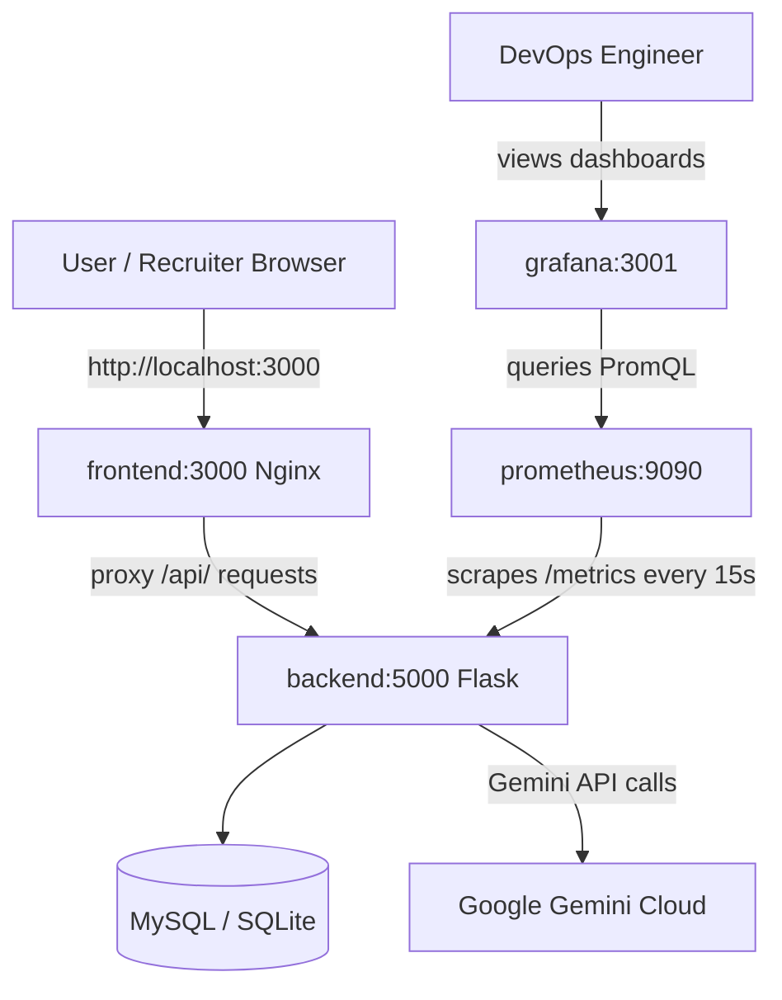

### Docker Compose Commands

```bash
# Build and start EVERYTHING with one command
docker-compose up -d --build

# View all running services
docker-compose ps

# View logs
docker-compose logs backend
docker-compose logs -f prometheus      # follow mode

# Stop everything
docker-compose stop

# Stop and remove everything (containers + networks)
docker-compose down

# Rebuild only one service after changes
docker-compose up -d --build backend

# Scale backend to handle more traffic
docker-compose up -d --scale backend=3
```

### Nginx Configuration (Reverse Proxy)

Nginx sits in front of the React app and proxies API calls to the Flask backend:

```nginx
server {
    listen 80;

    # Serve React SPA (Resume Builder)
    location / {
        root /usr/share/nginx/html;
        try_files $uri $uri/ /index.html;   # Client-side React Router
    }

    # Forward API calls to Flask backend container
    location /api/ {
        proxy_pass http://backend:5000/api/;  # Docker DNS resolves "backend"
        proxy_set_header Host $host;
        proxy_set_header X-Real-IP $remote_addr;
        proxy_read_timeout 120s;              # AI calls can be slow
    }

    # Security headers
    add_header X-Frame-Options "SAMEORIGIN";
    add_header X-Content-Type-Options "nosniff";
    add_header X-XSS-Protection "1; mode=block";
}
```

---

## 🔷 Step 6 — CI/CD Pipeline (GitHub Actions)
*(Syllabus: Unit IV — CI/CD Pipeline Fundamentals, Jenkins/GitHub Actions, Automating Builds & Deployments)*

Every time we push code to GitHub, we want to automatically:
1. Run tests to catch bugs
2. Build the frontend
3. Build Docker images
4. Deploy to production (if on `main` branch)

### What is CI/CD?

| Term | Meaning | In Resume Screener |
| :--- | :--- | :--- |
| **CI** — Continuous Integration | Auto-build and test on every push | `pytest` runs, React build validates |
| **CD** — Continuous Delivery | Auto-prepare deployable artifact | Docker images are built and pushed |
| **CD** — Continuous Deployment | Auto-deploy to production | Deploy to EC2 on `main` branch push |

### Pipeline Diagram

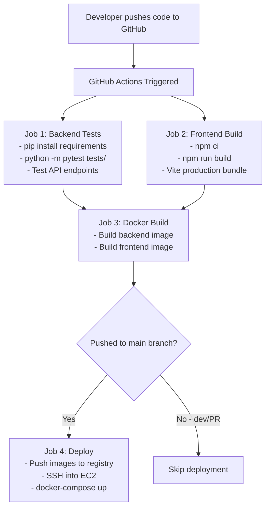

### Our Pipeline: `.github/workflows/ci-cd.yml`

```yaml
name: AI Resume Screener CI/CD Pipeline

on:
  push:
    branches: [main, dev]        # Runs on push to main or dev
  pull_request:
    branches: [main]             # Runs on PRs to main

jobs:
  # ═══════ JOB 1: Test Backend ═══════
  backend-test:
    name: Backend Tests
    runs-on: ubuntu-latest
    steps:
      - uses: actions/checkout@v4
      - uses: actions/setup-python@v5
        with:
          python-version: '3.11'
      - name: Install dependencies
        run: pip install -r backend/requirements.txt
      - name: Install test tools
        run: pip install pytest
      - name: Run API tests
        run: python -m pytest backend/tests/ -v
        env:
          FLASK_ENV: testing
          GEMINI_API_KEY: ${{ secrets.GEMINI_API_KEY }}

  # ═══════ JOB 2: Build Frontend ═══════
  frontend-build:
    name: Frontend Build
    runs-on: ubuntu-latest
    steps:
      - uses: actions/checkout@v4
      - uses: actions/setup-node@v4
        with:
          node-version: '20'
      - name: Install and build
        run: |
          cd client
          npm ci                   # Clean install (uses package-lock.json)
          npm run build            # Production Vite bundle → client/dist/

  # ═══════ JOB 3: Build Docker Images ═══════
  docker-build:
    name: Docker Build
    runs-on: ubuntu-latest
    needs: [backend-test, frontend-build]   # Only runs after BOTH jobs pass
    steps:
      - uses: actions/checkout@v4
      - name: Build backend image
        run: docker build -f docker/Dockerfile.backend -t resume-backend .
      - name: Build frontend image
        run: docker build -f docker/Dockerfile.frontend -t resume-frontend .

  # ═══════ JOB 4: Deploy (main branch only) ═══════
  deploy:
    name: Deploy to Production
    runs-on: ubuntu-latest
    needs: [docker-build]
    if: github.ref == 'refs/heads/main'    # ONLY on main branch
    steps:
      - uses: actions/checkout@v4
      - name: Deploy to AWS EC2 via SSH
        run: |
          echo "Deploying AI Resume Screener to production EC2..."
          # SSH into EC2, pull latest code, docker-compose up
```

> **Key points:**
> - Jobs 1 and 2 run **in parallel** (they are independent)
> - Job 3 **waits** for both to pass before building Docker images
> - Job 4 **only runs** when code is pushed to `main` (not `dev` or PRs)

---

## 🔷 Step 7 — Infrastructure as Code with Terraform
*(Syllabus: Unit III — IaC Principles, Templates, Tools like Terraform and CloudFormation)*

We need a server to run our Docker containers. Instead of clicking through the AWS Console manually, we write code to provision infrastructure automatically.

### What is IaC (Infrastructure as Code)?

| Traditional Way | IaC Way (Terraform) |
| :--- | :--- |
| Log into AWS Console | Write `main.tf` file |
| Click "Launch Instance" | Run `terraform apply` |
| Manually configure security groups | Defined in code and version-controlled |
| Can't reproduce — forgot what you clicked | Same code = same result every time |
| Not auditable | Code reviews catch mistakes |

### Terraform Workflow

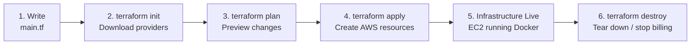

### How Terraform State Works

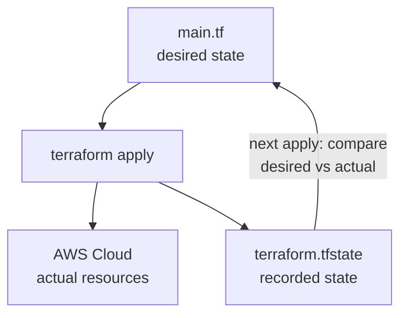

### Our Terraform Configuration (`terraform/main.tf`)

```hcl
# ═══ Cloud Provider ═══
provider "aws" {
  region = "us-east-1"
}

# ═══ Firewall Rules (Security Group) ═══
resource "aws_security_group" "resume_sg" {
  name = "resume-screener-sg"

  # SSH access
  ingress { from_port = 22;   to_port = 22;   protocol = "tcp"; cidr_blocks = ["0.0.0.0/0"] }
  # Flask Backend API
  ingress { from_port = 5000; to_port = 5000; protocol = "tcp"; cidr_blocks = ["0.0.0.0/0"] }
  # React Frontend via Nginx
  ingress { from_port = 80;   to_port = 80;   protocol = "tcp"; cidr_blocks = ["0.0.0.0/0"] }
  ingress { from_port = 3000; to_port = 3000; protocol = "tcp"; cidr_blocks = ["0.0.0.0/0"] }
  # Prometheus
  ingress { from_port = 9090; to_port = 9090; protocol = "tcp"; cidr_blocks = ["0.0.0.0/0"] }
  # Grafana
  ingress { from_port = 3001; to_port = 3001; protocol = "tcp"; cidr_blocks = ["0.0.0.0/0"] }

  # All outbound traffic allowed
  egress  { from_port = 0;    to_port = 0;    protocol = "-1";  cidr_blocks = ["0.0.0.0/0"] }
}

# ═══ The Actual Server (EC2 Instance) ═══
resource "aws_instance" "resume_server" {
  ami                    = "ami-0c55b159cbfafe1f0"   # Amazon Linux 2
  instance_type          = "t2.medium"               # 2 vCPU, 4GB — needed for ML inference
  key_name               = "resume-screener-key"
  vpc_security_group_ids = [aws_security_group.resume_sg.id]

  # Startup script — runs once when EC2 launches
  user_data = <<-EOF
    #!/bin/bash
    yum update -y
    amazon-linux-extras install docker -y
    systemctl start docker && systemctl enable docker
    # Install Docker Compose
    curl -L "https://github.com/docker/compose/releases/latest/download/docker-compose-$(uname -s)-$(uname -m)" \
      -o /usr/local/bin/docker-compose
    chmod +x /usr/local/bin/docker-compose
    # Clone and launch the project
    git clone https://github.com/USERNAME/Resume_Screener.git /app
    cd /app && docker-compose up -d --build
  EOF

  tags = { Name = "ai-resume-screener-server" }
}

# ═══ Outputs — shown after terraform apply ═══
output "backend_url" {
  value = "http://${aws_instance.resume_server.public_ip}:5000"
}
output "frontend_url" {
  value = "http://${aws_instance.resume_server.public_ip}"
}
output "grafana_dashboard" {
  value = "http://${aws_instance.resume_server.public_ip}:3001"
}
```

### Terraform Commands

```bash
cd terraform/

# 1. Initialize — downloads AWS provider plugin
terraform init

# 2. Plan — shows what WILL be created (preview only, no changes)
terraform plan

# 3. Apply — actually creates EC2 instance + security group
terraform apply
# Type "yes" to confirm

# 4. View outputs after creation
terraform output
# backend_url       = "http://54.123.45.67:5000"
# frontend_url      = "http://54.123.45.67"
# grafana_dashboard = "http://54.123.45.67:3001"

# 5. Destroy — tear down everything (stops billing)
terraform destroy
```

---

## 🔷 Step 8 — Cloud Services & Deployment Models
*(Syllabus: Unit III — AWS EC2, Lambda, Elastic Beanstalk, GCP; Unit I — Cloud Deployment Models)*

### Where Resume Screener Can Be Deployed

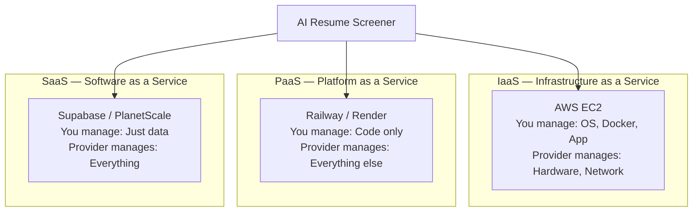

| Model | What YOU manage | What THEY manage | Resume Screener Example | Cost |
| :--- | :--- | :--- | :--- | :--- |
| **IaaS** | OS, Runtime, App, Data | Servers, Storage, Network | AWS EC2 (via Terraform) | Pay per server hour |
| **PaaS** | Just your code | OS, Runtime, Servers | Railway (already deployed!) | Free tier available |
| **SaaS** | Nothing — just use it | Everything | Supabase (Managed DB) | Free tier available |

### Cloud Deployment Types

| Type | Description | Resume Screener Setup |
| :--- | :--- | :--- |
| **Public Cloud** | Shared infra, anyone can rent | AWS EC2, Railway, Render |
| **Private Cloud** | Dedicated to one company | Docker on your own server |
| **Hybrid Cloud** | Mix of public + private | Backend on EC2 + DB on managed RDS |
| **Community Cloud** | Shared within a sector | University-shared cloud resources |

---

## 🔷 Step 9 — Container Orchestration with Kubernetes
*(Syllabus: Unit II — Container Orchestration using Kubernetes)*

What happens during job application season when **1,000 users** upload resumes simultaneously? A single backend Flask container will be overwhelmed. We need to **scale**.

### Kubernetes (K8s) Lifecycle

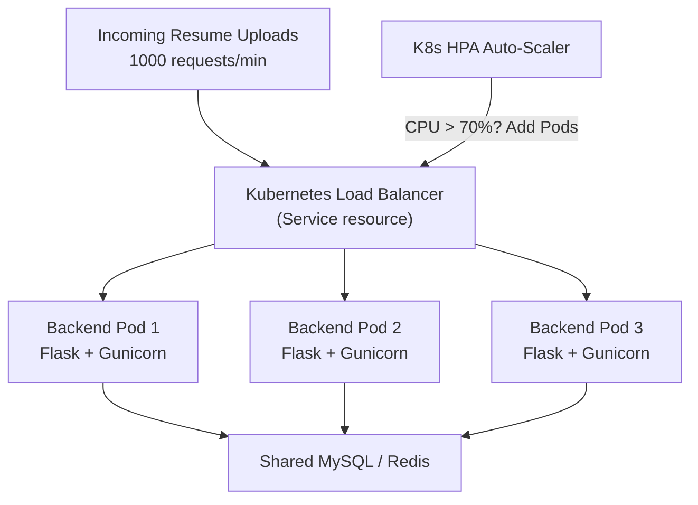

| K8s Feature | How it helps the Resume Screener |
| :--- | :--- |
| **Auto-Scaling (HPA)** | Spins up more backend Pods when many resumes are uploaded |
| **Load Balancing** | Distributes requests evenly across Flask Pods |
| **Self-Healing** | If a Pod crashes mid-analysis, K8s immediately restarts it |
| **Rolling Updates** | Deploy new Gemini model versions with zero downtime |

### Key Kubernetes Objects in Our Setup

```yaml
# kubernetes/deployment.yaml
apiVersion: apps/v1
kind: Deployment
metadata:
  name: resume-backend
spec:
  replicas: 3                    # Run 3 Flask pods
  selector:
    matchLabels:
      app: resume-backend
  template:
    spec:
      containers:
      - name: backend
        image: myuser/resume-backend:latest
        ports:
        - containerPort: 5000
        env:
        - name: GEMINI_API_KEY
          valueFrom:
            secretKeyRef:
              name: resume-secrets
              key: gemini-api-key
---
# Horizontal Pod Autoscaler
apiVersion: autoscaling/v2
kind: HorizontalPodAutoscaler
metadata:
  name: resume-backend-hpa
spec:
  scaleTargetRef:
    apiVersion: apps/v1
    kind: Deployment
    name: resume-backend
  minReplicas: 2
  maxReplicas: 10
  metrics:
  - type: Resource
    resource:
      name: cpu
      target:
        type: Utilization
        averageUtilization: 70     # Scale up if CPU > 70%
```

---

## 🔷 Step 10 — Monitoring with Prometheus & Grafana
*(Syllabus: Unit V — Monitoring and Observability, Prometheus, Grafana, Logs and Dashboards)*

The app is deployed. But we need to know:
- How many resumes have been screened today?
- What is the average ATS scoring time?
- Are there errors in the Gemini API calls?
- Is the server healthy?

### How Monitoring Works

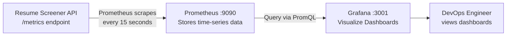

### Step 10a — Our `/metrics` Endpoint (Built into Flask)

```python
# In backend/app.py — expose metrics for Prometheus
@app.get("/metrics")
def metrics():
    return f"""
# HELP resumes_analyzed_total Total number of resumes analyzed
# TYPE resumes_analyzed_total counter
resumes_analyzed_total {total_analyzed}

# HELP ats_score_avg Average ATS score given
# TYPE ats_score_avg gauge
ats_score_avg {avg_ats_score}

# HELP gemini_calls_total Total Gemini API calls made
# TYPE gemini_calls_total counter
gemini_calls_total {gemini_calls}

# HELP gemini_errors_total Failed Gemini API calls
# TYPE gemini_errors_total counter
gemini_errors_total {gemini_errors}

# HELP http_requests_total Total HTTP requests
# TYPE http_requests_total counter
http_requests_total {request_count}
""", 200, {'Content-Type': 'text/plain'}
```

### Step 10b — Prometheus Configuration

```yaml
# monitoring/prometheus.yml
global:
  scrape_interval: 15s          # Check every 15 seconds

scrape_configs:
  - job_name: 'resume-screener-api'
    metrics_path: '/metrics'     # The endpoint we built
    static_configs:
      - targets: ['backend:5000'] # Docker service name
```

### Step 10c — Grafana Setup

```yaml
# monitoring/grafana-datasources.yml
apiVersion: 1
datasources:
  - name: Prometheus
    type: prometheus
    access: proxy
    url: http://prometheus:9090  # Docker service name
    isDefault: true
```

**Access Grafana:**
```
URL:      http://localhost:3001
Username: admin
Password: resume123
```

**Dashboard panels to create:**

| Panel | Metric | Chart Type |
| :--- | :--- | :--- |
| Total Resumes Screened | `resumes_analyzed_total` | Counter / Stat |
| Average ATS Score | `ats_score_avg` | Gauge |
| Gemini API Success Rate | `1 - (gemini_errors / gemini_calls)` | Pie Chart |
| Request Rate / min | `rate(http_requests_total[1m])` | Time Series |
| Error Rate | `rate(gemini_errors_total[1m])` | Alert Panel |

---

## 🔷 Step 11 — Security & DevSecOps
*(Syllabus: Unit V — IAM, Shared Responsibility, DevSecOps; Unit VI — Security by Design)*

Because resumes contain highly **sensitive personal data** (names, emails, phones, employment history):

### AWS IAM (Identity and Access Management)

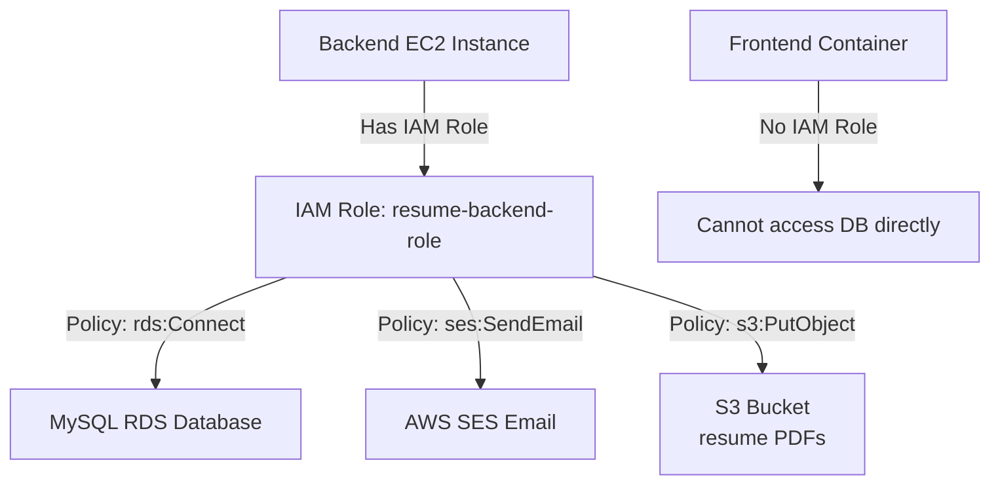

> **Principle of Least Privilege:** Each component only gets the exact permissions it needs. The frontend cannot touch the database directly.

### DevSecOps in the CI/CD Pipeline

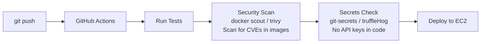

**Security practices in this project:**
- `.env` files are in `.gitignore` — secrets never committed to Git
- `GEMINI_API_KEY`, `SMTP_PASS`, `SECRET_KEY` — all via environment variables
- Session cookies use `SameSite=None; Secure=True` in production
- OTPs expire after 10 minutes (hardcoded in `database.py`)
- CORS whitelist configured in `app.py` via `Flask-CORS`

---

## 🔷 Complete System — Everything Together

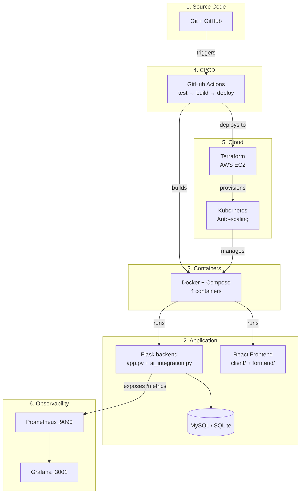

---

## 🔷 All Commands — Quick Reference

```bash
# ══════ GIT ══════
git init                                     # Initialize repo
git add .                                    # Stage changes
git commit -m "feat: add Gemini ATS scoring" # Save snapshot
git push origin main                         # Push to GitHub
git checkout -b dev                          # Create branch

# ══════ BACKEND ══════
cd backend
pip install -r requirements.txt              # Install deps
python app.py                                # Dev server (port 5000)
gunicorn app:app --workers 4 --bind 0.0.0.0:5000  # Production

# ══════ FRONTEND ══════
cd client
npm install                                  # Install deps
npm run dev                                  # Dev server (port 5173)
npm run build                                # Build → client/dist/

# ══════ TESTING ══════
python -m pytest backend/tests/ -v          # Run API tests

# ══════ DOCKER ══════
docker build -f docker/Dockerfile.backend -t resume-backend .
docker build -f docker/Dockerfile.frontend -t resume-frontend .
docker run -d -p 5000:5000 resume-backend
docker ps                                    # List running containers
docker logs backend                          # View logs
docker stop backend                          # Stop container

# ══════ DOCKER COMPOSE ══════
docker-compose up -d --build                 # Start all 4 services
docker-compose ps                            # Status
docker-compose logs -f backend               # Follow logs
docker-compose down                          # Stop everything

# ══════ TERRAFORM ══════
cd terraform/
terraform init                               # Download providers
terraform plan                               # Preview
terraform apply                              # Create AWS resources
terraform output                             # Show URLs
terraform destroy                            # Tear down

# ══════ KUBERNETES ══════
kubectl apply -f kubernetes/                 # Deploy all objects
kubectl get pods                             # List pods
kubectl scale deployment resume-backend --replicas=5
kubectl logs -f deployment/resume-backend    # Follow pod logs

# ══════ MONITORING ══════
curl http://localhost:5000/metrics           # View raw Prometheus metrics
# Open http://localhost:9090                 # Prometheus UI
# Open http://localhost:3001                 # Grafana (admin / resume123)
```

---

## 🔷 Course Outcome Mapping

| CO | What Was Required | How Resume Screener Implements It |
| :--- | :--- | :--- |
| **CO1** | Cloud fundamentals, delivery models, DevOps basics | IaaS (EC2), PaaS (Railway — already deployed!), SaaS (Supabase). Full DevOps lifecycle. Git version control from Day 1. |
| **CO2** | Virtualization, containerization, cloud infrastructure | Docker multi-stage builds for backend + frontend. Docker Compose with 4 services. Nginx reverse proxy. VM vs Container comparison documented. |
| **CO3** | IaC tools for cloud provisioning | Terraform `main.tf` provisions EC2 + Security Groups. One `terraform apply` = working server. |
| **CO4** | CI/CD pipelines, Jenkins, automating builds & deployments | GitHub Actions pipeline with 4 jobs: test, build, docker, deploy. Jobs run in parallel, auto-deploys to EC2 on `main` branch push. |
| **CO5** | Monitoring, observability, Prometheus, Grafana | Prometheus scrapes `/metrics` endpoint. Grafana dashboards track ATS scoring rates, Gemini API health, and error rates. OTP expiry + session security documented. |
